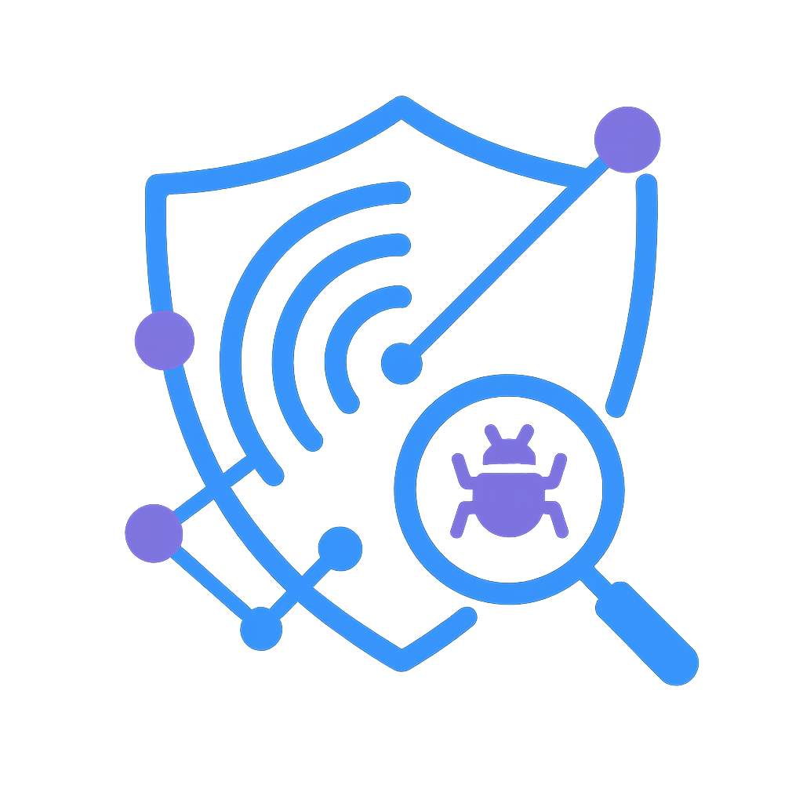

<p align="center">
  
</p>

# PAI Cyber Threat Intelligence Skill

> AI-powered Cyber Threat Intelligence platform for comprehensive threat analysis, detection rule generation, and intelligence sharing using industry frameworks

> **Installation:** This pack is designed for AI-assisted installation. Give this directory to your AI and ask it to install using the wizard in `INSTALL.md`. The installation dynamically adapts to your system state. See [AI-First Installation Philosophy](../../README.md#ai-first-installation-philosophy) for details.

---

## Quick Start

```bash
# 1. Set PAI_DIR (add to ~/.zshrc or ~/.bashrc)
export PAI_DIR="$HOME/.claude"

# 2. Extract IoCs from any threat report
bun run $PAI_DIR/skills/cti/Tools/IoCExtractor.ts "Check 192.168.1.1 and evil.com"

# 3. Or ask your AI assistant
"Analyze this threat report and extract all indicators"
```

**Prerequisites:** [Bun](https://bun.sh) runtime, Claude Code with pai-knowledge-system installed.

---

## What's Included

| Component | File | Purpose |
|-----------|------|---------|
| CTI skill | `src/skills/cti/SKILL.md` | Routing and workflow orchestration |
| Feed Manager | `src/skills/cti/Tools/FeedManager.ts` | CLI for managing threat intelligence feeds |
| IoC Extractor | `src/skills/cti/Tools/IoCExtractor.ts` | Extract indicators from text/reports |
| STIX Generator | `src/skills/cti/Tools/StixGenerator.ts` | Generate STIX 2.1 bundles |
| IoC Patterns | `src/skills/cti/Data/IoCPatterns.yaml` | Regex patterns for IoC extraction |
| Feed Sources | `src/skills/cti/Data/TISources.yaml` | Curated threat intelligence feeds |
| 11 Workflows | `src/skills/cti/Workflows/*.md` | Procedures for all CTI operations |
| 4 Frameworks | `src/skills/cti/Frameworks/*.md` | MITRE ATT&CK, Kill Chain, Diamond Model, Risk Scoring |

**Summary:**
- **Files created:** 20+
- **CLI tools:** 3
- **Dependencies:** pai-knowledge-system (for storing intelligence)

---

## The Problem

Security teams face an overwhelming flood of threat intelligence:

1. **Feed Overload**: Dozens of feeds, each with different formats (JSON, CSV, XML, RSS, Markdown)
2. **Manual Extraction**: Copying IoCs from reports is tedious and error-prone
3. **Framework Alignment**: Mapping threats to ATT&CK, Kill Chain, Diamond Model manually
4. **Rule Creation**: Writing YARA/Sigma rules requires deep expertise
5. **Sharing Standards**: Creating STIX bundles for intelligence sharing is complex
6. **Risk Prioritization**: No systematic way to assess which threats matter most

**The result:** Analysts spend more time on data processing than actual analysis.

---

## The Solution

The CTI skill automates the entire threat intelligence lifecycle:

```
Threat Report / Feed Data
         |
         v
[IoC Extraction] ─── IoCExtractor.ts
         |            - IPv4/IPv6, domains, URLs
         |            - Hashes (MD5, SHA1, SHA256)
         |            - CVEs, MITRE ATT&CK IDs
         v
[Framework Mapping] ─── Workflows + Frameworks/
         |               - MITRE ATT&CK alignment
         |               - Kill Chain phase
         |               - Diamond Model features
         v
[Risk Assessment] ─── ISO 27001/27005 methodology
         |             - Likelihood × Impact
         |             - Control effectiveness
         v
[Detection Rules] ─── YARA, Sigma generation
         |
         v
[Intelligence Sharing] ─── STIX 2.1 bundles
         |                   StixGenerator.ts
         v
[Knowledge Storage] ─── pai-knowledge integration
```

---

## Architecture

```
USER REQUEST: "Analyze this threat report"
         |
         v
┌─────────────────────────────────────────────────────────────┐
│                        SKILL.md                              │
│  Routing layer - matches intent to workflow                  │
│  "analyze threat" → AnalyzeIntelligence.md                  │
└─────────────────────────────────────────────────────────────┘
         |
         v
┌─────────────────────────────────────────────────────────────┐
│                    WORKFLOW LAYER                            │
│  AnalyzeIntelligence.md orchestrates:                       │
│  1. Fetch content (Browser skill)                           │
│  2. Extract IoCs (IoCExtractor.ts)                          │
│  3. Map to ATT&CK (Frameworks/MitreAttack.md)              │
│  4. Assess risk (Frameworks/RiskScoring.md)                 │
│  5. Store findings (Knowledge skill)                         │
└─────────────────────────────────────────────────────────────┘
         |
         v
┌─────────────────────────────────────────────────────────────┐
│                      TOOL LAYER                              │
│  CLI tools with deterministic behavior:                      │
│  - FeedManager.ts: list, add, remove, test feeds            │
│  - IoCExtractor.ts: extract --format json                   │
│  - StixGenerator.ts: --indicator "ip:1.2.3.4" --tlp amber   │
└─────────────────────────────────────────────────────────────┘
         |
         v
┌─────────────────────────────────────────────────────────────┐
│                    FRAMEWORK LAYER                           │
│  Reference documentation for consistent analysis:            │
│  - MitreAttack.md: Tactic/Technique mapping                 │
│  - CyberKillChain.md: Phase identification                  │
│  - DiamondModel.md: Adversary/Capability/Infra/Victim       │
│  - RiskScoring.md: ISO 27001/27005 calculation              │
└─────────────────────────────────────────────────────────────┘
```

**Key Architectural Decisions:**

1. **Explicit Routing**: SKILL.md frontmatter triggers define when CTI activates
2. **Workflow Orchestration**: Each workflow documents the exact steps, not fuzzy instructions
3. **CLI Determinism**: Tools have flags and options - same input, same output
4. **Framework Integration**: Reference docs ensure consistent threat modeling
5. **Standards Compliance**: STIX 2.1, TLP 2.0, NATO Admiralty Code for confidence

---

## Why Use This

Unlike commercial TI platforms requiring expensive subscriptions and dedicated staff, the PAI CTI skill brings enterprise-grade threat intelligence directly into your AI assistant:

- **Natural Language**: Ask questions instead of learning complex UIs
- **Built-in Frameworks**: MITRE ATT&CK, Kill Chain, Diamond Model ready to use
- **Automatic Detection**: YARA/Sigma rules generated from analysis
- **Persistent Memory**: Intelligence stored in your knowledge graph

---

## Invocation Scenarios

| User Request | Workflow | Output |
|--------------|----------|--------|
| "Check the latest threat intelligence feeds" | MonitorFeeds | Feed updates summary |
| "Analyze this threat report" | AnalyzeIntelligence | Framework-aligned analysis |
| "Extract all IoCs from this malware report" | ExtractIoCs | Structured IoC list |
| "Map these TTPs to MITRE ATT&CK" | MapToFrameworks | ATT&CK technique mappings |
| "Assess the risk of this threat" | AssessRisk | Risk score with methodology |
| "Create YARA rules for this malware" | GenerateYara | Valid YARA rules |
| "Create Sigma rules for this behavior" | GenerateSigma | Valid Sigma rules |
| "Package this as a STIX bundle" | CreateStixBundle | STIX 2.1 JSON bundle |
| "Enrich these IP addresses" | EnrichIoCs | Enriched indicator data |
| "Generate a threat report" | ThreatReport | Comprehensive TI report |
| "Add a new threat feed" | ManageFeeds | Feed configuration updated |

---

## Example Usage

### Extract IoCs from a Report

```bash
bun run $PAI_DIR/skills/cti/Tools/IoCExtractor.ts report.txt --format table
```

Output:
```
================================================================================
IoC Extraction Report
Extracted at: 2026-01-10T21:00:00.000Z
Source: report.txt
Total IoCs: 15
================================================================================

[IPV4] (3)
----------------------------------------
  192.168.1.100
  10.0.0.50
  203.0.113.42

[SHA256] (2)
----------------------------------------
  e3b0c44298fc1c149afbf4c8996fb92427ae41e4649b934ca495991b7852b855
  ...
```

### Generate STIX Bundle

```bash
bun run $PAI_DIR/skills/cti/Tools/StixGenerator.ts \
  --indicator "ip:203.0.113.42" \
  --name "APT29 C2 Server" \
  --tlp amber \
  --output bundle.json
```

### Test Threat Feeds

```bash
bun run $PAI_DIR/skills/cti/Tools/FeedManager.ts test --all
```

---

## Configuration

**Environment variables:**

Add to your shell profile (`~/.zshrc` or `~/.bashrc`):
```bash
export PAI_DIR="$HOME/.claude"
```

> **Note:** The `.env` file in `$PAI_DIR/.env` is for API keys only. Shell variables like `$HOME` do not expand in `.env` files.

**API Keys (optional, for premium feeds):**
```bash
# Add to $PAI_DIR/.env for enabled feeds
PAI_CTI_OTX_API_KEY="your-alienvault-otx-key"
PAI_CTI_VIRUSTOTAL_API_KEY="your-virustotal-key"
PAI_CTI_SHODAN_API_KEY="your-shodan-key"
PAI_CTI_URLSCAN_API_KEY="your-urlscan-key"
```

---

## Customization

### Recommended Customization

**Add Your Organization's Context:**

The risk assessment workflow can be customized with your organization's specific assets, threat landscape, and control maturity.

**Process:**
1. Edit `Frameworks/RiskScoring.md` to reflect your control effectiveness
2. Update asset criticality levels for your environment
3. Add sector-specific threat actors to prioritize

### Optional Customization

| Customization | File | Impact |
|---------------|------|--------|
| Add custom feeds | `Data/TISources.yaml` | New threat sources |
| Modify IoC patterns | `Data/IoCPatterns.yaml` | Custom indicator types |
| Adjust risk thresholds | `Frameworks/RiskScoring.md` | Risk scoring calibration |

---

## Known Issues

⚠️ **RediSearch Hyphen Parsing Bug** - Domain names containing hyphens (e.g., `malware-c2.evil.com`) may not be searchable when stored in the knowledge graph. RediSearch interprets `-` as a negation operator. See [Known Issues](docs/known-issues.md) for workarounds.

For full list of known issues and workarounds, see [docs/known-issues.md](docs/known-issues.md).

---

## Ethical Guidelines

1. **Authorized Use Only** - Use for defensive security purposes
2. **TLP Compliance** - Respect sharing classifications
3. **No Active Threats** - Never execute malicious code
4. **Attribution Caution** - Note confidence levels for attribution
5. **Source Protection** - Protect sensitive sources and methods
6. **Legal Compliance** - Adhere to applicable laws and regulations

---

## Credits

- **Original concept**: PAI Project
- **Framework references**: MITRE ATT&CK, Lockheed Martin Cyber Kill Chain, Diamond Model, ISO 27001/27005
- **Feed sources**: abuse.ch, CISA, OpenPhish, PhishTank, SANS ISC

---

## Changelog

### 1.0.0 - 2026-01-10
- Initial release
- Three CLI tools: FeedManager, IoCExtractor, StixGenerator
- Eleven workflows covering full CTI lifecycle
- Four framework references for consistent analysis
- Curated list of 18 threat intelligence feeds
